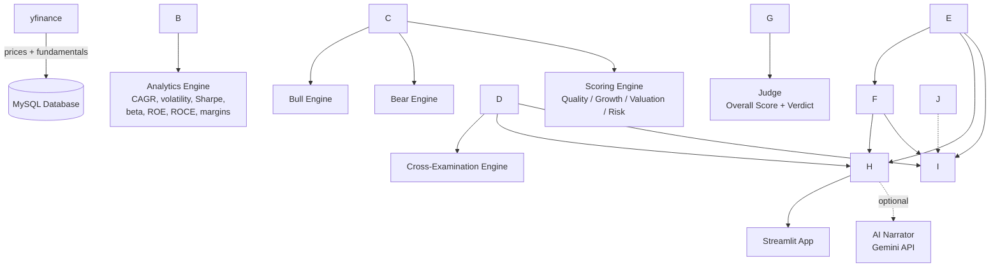

# ⚖️ Investment Courtroom

**Every investment has a case. The Court decides whether it deserves your money.**

A rule-based investment analysis tool that puts a stock "on trial." A Bull side builds the
strongest case for investing, a Bear side builds the strongest case against it, a Cross-Examination
engine checks where their evidence actually contradicts, and a Judge combines everything into an
explainable BUY / HOLD / AVOID verdict — all backed by real financial data, not a black-box model.

Built as a portfolio project to combine Python, SQL, data analytics, and financial analysis into
something that actually works end-to-end, not just a notebook.

\---


\## Screenshots


\*\*Home\*\*

!\[Home page](docs/screenshots/01\_home.png)


\*\*Stock Court\*\* — real 5-year price history and key metrics

!\[Stock Court](docs/screenshots/02\_stock\_court.png)


\*\*Bull vs Bear\*\* — TCS: strong fundamentals vs. a real multi-year price decline

!\[Bull vs Bear](docs/screenshots/03\_bull\_vs\_bear.png)


\*\*Judge's Verdict\*\* — the same TCS case, combined into one explainable score

!\[Judge's Verdict](docs/screenshots/04\_judges\_verdict.png)


\*\*Stress Test\*\* — MARUTI's verdict shifting under a simulated downturn

!\[Stress Test](docs/screenshots/05\_stress\_test.png)


\*\*Portfolio Court\*\* — sector concentration and diversification check

!\[Portfolio Court](docs/screenshots/06\_portfolio\_court.png)


\*\*Historical Case Mode\*\* — blind-guessing game using real historical data

!\[Historical Case Mode](docs/screenshots/07\_historical\_case.png)

## What it actually does

* **Stock Court** — pick any of 15 tracked companies, see a 5-year price chart and 8 key financial metrics
* **Bull vs Bear** — rule-based arguments generated from real computed ratios (CAGR, ROE, ROCE, Sharpe, beta, margins)
* **Cross-Examination** — checks whether the Bear's evidence actually undercuts a specific Bull claim (e.g. "growth looks strong, but it's already priced into an expensive P/E")
* **Judge's Verdict** — a weighted 4-pillar score (Quality / Growth / Valuation / Risk) with a plain-language explanation of the strongest arguments on each side
* **Stress Test** — drag sliders to simulate a revenue decline, margin compression, or P/E contraction, and watch the verdict update live
* **Portfolio Court** — build a multi-stock portfolio and get real diversification-aware volatility, drawdown, Sharpe ratio, and a sector-concentration check
* **Historical Case Mode** — a blind-guessing game: see a real, anonymized case from \~2 years ago, guess BUY/HOLD/AVOID, then find out what actually happened
* **Investor DNA** — a behavioral profile (growth bias, risk appetite, valuation discipline, etc.) built from your own decisions in Historical Case Mode
* **AI Courtroom** *(optional)* — the same computed evidence, narrated as natural courtroom dialogue by an LLM, which is strictly constrained to never invent a number

\---

## Tech stack

|Layer|Tool|
|-|-|
|Language|Python|
|Data analysis|Pandas, NumPy|
|Database|MySQL|
|Visualization|Plotly|
|Web app|Streamlit|
|AI narration (optional)|Google Gemini API|
|Data source|yfinance|
|Version control|Git / GitHub|

\---

## How it works



Nothing downstream of the database is a black box — every argument the Bull or Bear makes, and
every score the Judge produces, is directly traceable back to a real, computed number. The optional
AI layer only rephrases evidence that already exists; it is never asked to analyze anything itself.

\---

## Database schema

```mermaid
erDiagram
    companies ||--o{ stock\_prices : has
    companies ||--o{ financial\_statements : has
    companies ||--o{ valuation\_metrics : has
    companies ||--o{ financial\_ratios : has
    companies ||--o{ investment\_cases : has
    investment\_cases ||--o{ user\_decisions : has

    companies {
        int company\_id PK
        string name
        string ticker
        string sector
    }
    stock\_prices {
        int price\_id PK
        int company\_id FK
        date price\_date
        decimal close\_price
        bigint volume
    }
    financial\_statements {
        int statement\_id PK
        int company\_id FK
        date period\_end\_date
        decimal revenue
        decimal net\_income
        decimal total\_debt
        decimal equity
    }
    valuation\_metrics {
        int valuation\_id PK
        int company\_id FK
        decimal market\_cap
        decimal pe\_ratio
        decimal pb\_ratio
    }
    financial\_ratios {
        int ratio\_id PK
        int company\_id FK
        decimal cagr
        decimal volatility
        decimal sharpe\_ratio
        decimal beta
        decimal roe
        decimal roce
    }
    investment\_cases {
        int case\_id PK
        int company\_id FK
        date case\_date
        decimal outcome\_return\_1y
    }
    user\_decisions {
        int decision\_id PK
        int case\_id FK
        string decision
        boolean was\_correct
    }
```

\---

## Companies covered

15 large-cap NSE-listed companies across Banking, IT, Energy, FMCG, Auto, Pharma, and Cement,
plus the Nifty 50 index as a market benchmark for beta calculations.

\---

## Running it locally

```bash
git clone https://github.com/Athuu060107/investment-courtroom.git
cd investment-courtroom
python -m venv venv
venv\\Scripts\\activate          # Windows
pip install -r requirements.txt
```

Create a `.env` file in the project root with:

```
DB\_HOST=localhost
DB\_USER=your\_mysql\_user
DB\_PASSWORD=your\_mysql\_password
DB\_NAME=investment\_courtroom
GEMINI\_API\_KEY=your\_gemini\_api\_key   # only needed for the optional AI Courtroom page
```

Set up the database, then run the data pipeline in order:

```bash
python -m src.data.fetch\_prices
python -m src.data.fetch\_fundamentals
python -m src.data.fetch\_market\_index
python -m src.data.load\_to\_database
python -m src.analytics.save\_ratios
python -m src.data.generate\_historical\_cases
```

Then launch the app:

```bash
streamlit run app\\Home.py
```

\---

## Known limitations

* The scoring weights and Bull/Bear thresholds are illustrative, chosen to be reasonable and
explainable — not backtested or statistically optimized against real market outcomes.
* ROCE is unavailable for banks (HDFCBANK, ICICIBANK, SBIN) since they don't report EBIT in the
standard way — the tool surfaces this as a real limitation rather than hiding it.
* Historical Case Mode reconstructs price-based metrics (CAGR, volatility) as they would have
looked at the case date, but does not yet reconstruct historical fundamentals (ROE, margins) —
only current-day fundamentals are available in Investor DNA's Valuation Discipline score.
* Portfolio beta and CAGR use a weighted-average approximation rather than a full covariance-based
reconstruction (volatility and drawdown, however, ARE computed from real combined daily returns).
* The AI Courtroom feature depends on a third-party API (Google Gemini) with a free-tier quota;
every other feature in this app has zero dependency on any external AI service.

## Possible future improvements

* Reconstruct historical fundamentals for Historical Case Mode and Investor DNA
* Backtest and tune the scoring weights against actual historical outcomes
* Expand beyond 15 companies
* Deploy publicly (Streamlit Community Cloud)
* Add a proper covariance-matrix-based portfolio beta and expected return model

\---

## Author

Built by Atharva Jadhav as a personal project to bring together data analytics, financial
analysis, and full-stack Python development in one place.

